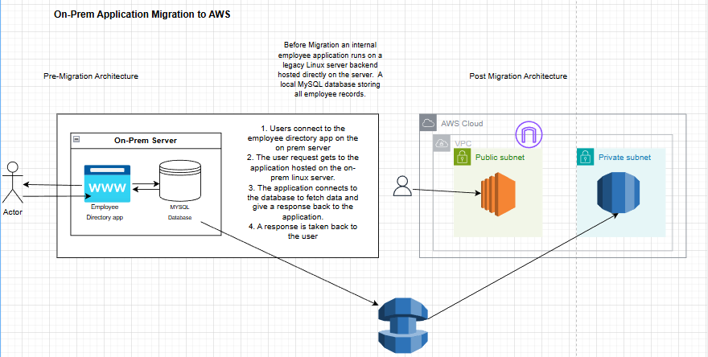
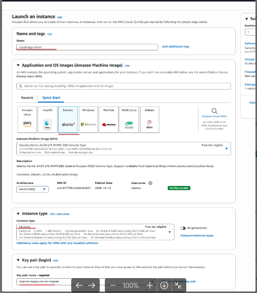
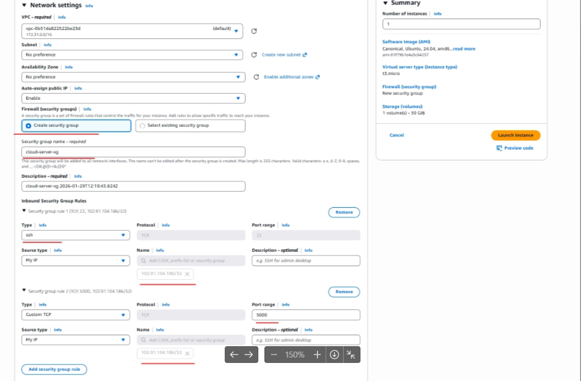
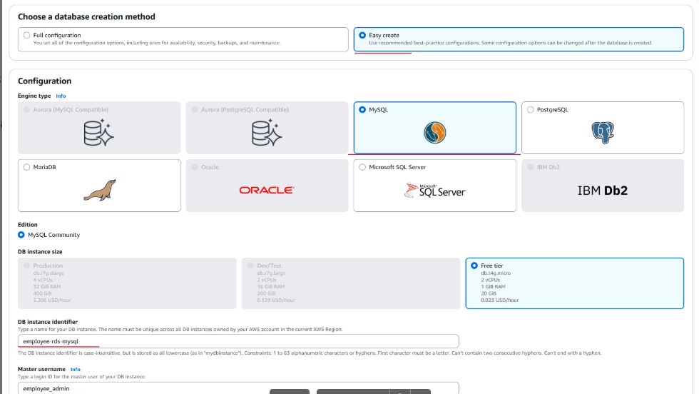
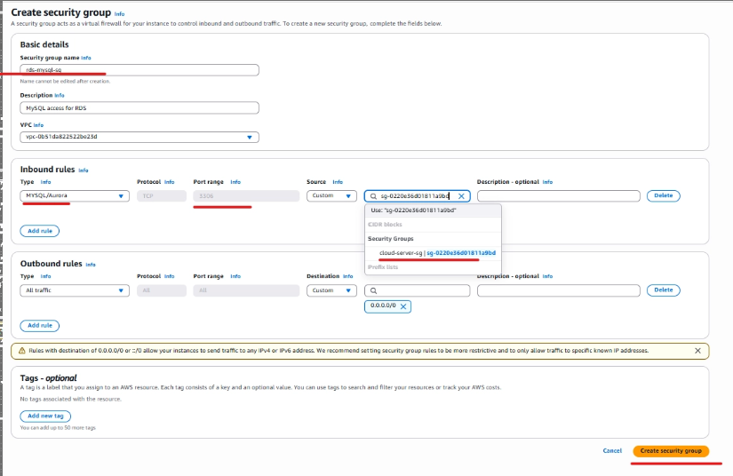
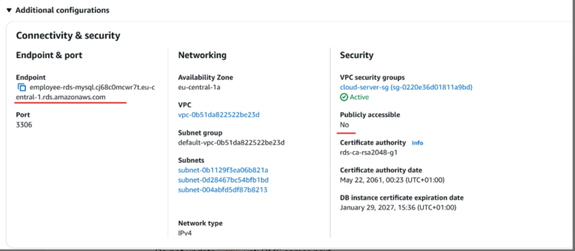
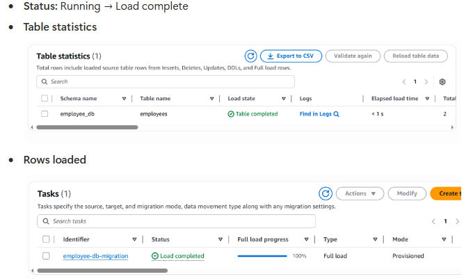
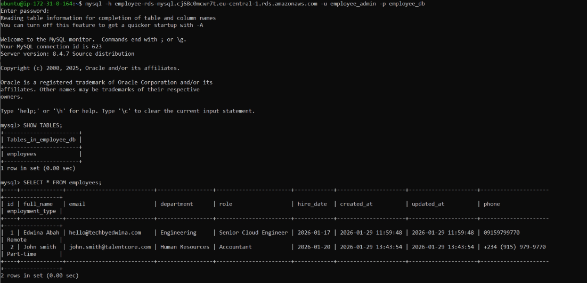

# On-Premise Application Migration to AWS (EC2 + RDS + DMS)

> **Read the full project write-up on Medium:** [link]
> **Connect on LinkedIn:** [link]

---

## TL;DR

A lift-and-shift migration of a two-tier application from a simulated on-premise environment to AWS. The application layer moves to EC2 and the MySQL database migrates to Amazon RDS using AWS Database Migration Service (DMS) — the same tooling used by enterprises migrating production workloads to the cloud.

---

## What This Project Demonstrates

- Planning and executing a lift-and-shift cloud migration
- Setting up AWS DMS with source and target endpoints, replication instance, and migration tasks
- Migrating a MySQL database to Amazon RDS with minimal downtime
- Configuring VPC networking to support migration connectivity
- Deploying and configuring EC2 as the migrated application host
- Verifying data integrity post-migration

---

## Prerequisites

- AWS account with admin IAM user
- Basic understanding of relational databases and MySQL
- SSH client for EC2 access

---
## Architecture Overview

## End-to-End Flow

1. **Legacy EC2** (simulating on-prem server) runs the Employee Directory App with a local MySQL database
2. A new **Cloud EC2** is provisioned — same app code is deployed here (Rehost / Lift & Shift)
3. **Amazon RDS (MySQL)** is provisioned in a private subnet as the new managed database target
4. **AWS DMS** (Database Migration Service) is configured with:
    - Source endpoint: Legacy EC2 MySQL
    - Target endpoint: Amazon RDS MySQL
5. DMS runs a **full-load migration** — all existing data moves from Legacy EC2 → RDS
6. Application config on Cloud EC2 is updated to point to the **RDS endpoint** instead of local MySQL
7. **Cutover** — traffic now flows through Cloud EC2 → RDS entirely
8. Legacy EC2 is decommissioned (optional cleanup step)
9. **VPC + Security Groups** control all traffic between EC2, RDS, and DMS throughout
## AWS Services Used

| Service | Purpose |
|---|---|
| Amazon EC2 | Hosts the migrated application layer |
| Amazon RDS MySQL | Target database — managed, scalable, automated backups |
| AWS Database Migration Service | Migrates data from source MySQL to target RDS |
| Amazon VPC | Network isolation and connectivity between components |
| AWS IAM | Access control for DMS and EC2 roles |

---

## DMS Configuration

### Replication Instance

| Setting | Value |
|---|---|
| Instance Class | `dms.t3.micro` |
| Engine Version | Latest stable |
| Multi-AZ | No (single AZ for this project) |
| Storage | 50 GB |
| VPC | Project VPC |

### Source Endpoint (MySQL on EC2)

| Setting | Value |
|---|---|
| Engine | MySQL |
| Server Name | EC2 private IP |
| Port | 3306 |
| Username | Migration user |
| SSL Mode | None (internal VPC traffic) |

### Target Endpoint (Amazon RDS MySQL)

| Setting | Value |
|---|---|
| Engine | Amazon Aurora MySQL / RDS MySQL |
| Server Name | RDS endpoint URL |
| Port | 3306 |
| Username | RDS admin user |

### Migration Task

| Setting | Value |
|---|---|
| Migration Type | Full load |
| Table mappings | All tables from source schema |
| LOB settings | Limited LOB mode |

> [📸 Screenshot: DMS replication instance in Available state]
> [📸 Screenshot: Source and target endpoints showing Successful connection test]
> [📸 Screenshot: Migration task showing Load Complete status]

---

## Implementation Breakdown

### Implementation 1: Set Up the Source Environment

Provisions the simulated on-premise environment — an EC2 instance running MySQL with a pre-populated database. This becomes the migration source.

**Validated:** MySQL running on EC2, database populated with test records, accessible on port 3306 from within the VPC.

> [📸 Screenshot: EC2 instance running with MySQL service active]
> 

---

### Implementation 2: Provision the Target RDS Instance

Creates an RDS MySQL instance in a private subnet as the migration target. Configures the subnet group, security group, and parameter group. Backup retention and encryption enabled.

**Validated:** RDS instance in Available state, connectivity confirmed from EC2.

> [📸 Screenshot: RDS console showing instance in Available state]
> [📸 Screenshot: Successful MySQL connection from EC2 to RDS endpoint]

---

### Implementation 3: Configure and Run AWS DMS

Creates the DMS replication instance, configures source and target endpoints with connection tests, then creates and runs a full-load migration task.

**Validated:** Migration task completes with Load Complete status. Table counts match between source and target. Data integrity confirmed by querying both databases.

> [📸 Screenshot: DMS migration task showing 100% table load complete]
> [📸 Screenshot: Table statistics showing matching row counts source vs target]

---

### Implementation 4: Validate and Cut Over

Queries both the source MySQL and target RDS to confirm data integrity. Updates the application configuration to point to the RDS endpoint. Final validation confirms the application is running fully on AWS.

> [📸 Screenshot: Query results matching between source and target databases]
> [📸 Screenshot: Application running on EC2 connecting to RDS endpoint]

---

## Key Design Decisions

**Why DMS instead of a manual mysqldump?**
DMS is the production-standard tool for database migrations on AWS. It handles data type mapping, large datasets, connection management, and provides monitoring and logging out of the box. Using DMS demonstrates the skill that actually matters in enterprise migration projects.

**Why RDS instead of MySQL on EC2?**
RDS removes the operational overhead of managing a database server — automated backups, patching, failover, and monitoring are all handled by AWS. For a migration project, this is the correct target: lift the application layer (EC2) and modernise the database layer (RDS) simultaneously.

**Why a private subnet for RDS?**
The database should never be directly reachable from the internet. Placing RDS in a private subnet and restricting inbound port 3306 to only the EC2 security group enforces this correctly.

---

## Skills Demonstrated

- Cloud migration planning and execution (lift-and-shift)
- AWS Database Migration Service (DMS) configuration
- RDS provisioning and database connectivity
- VPC networking for migration architecture
- Data integrity validation post-migration
- Application cutover to cloud infrastructure

---
## Key Points
- This is the "Rehost + Replatform" pattern — one of the 7 Rs of cloud migration
- DMS is the key differentiator here — it handles the actual data move with minimal downtime
- Why RDS instead of MySQL on EC2? Managed service = automated backups, patching, multi-AZ support
- Private subnet for RDS is a security best practice — it should NEVER be publicly accessible
- Security Groups are the firewall — EC2 SG allows app traffic inbound, RDS SG only allows traffic FROM the EC2 SG

## Related

- Medium article: [link]
